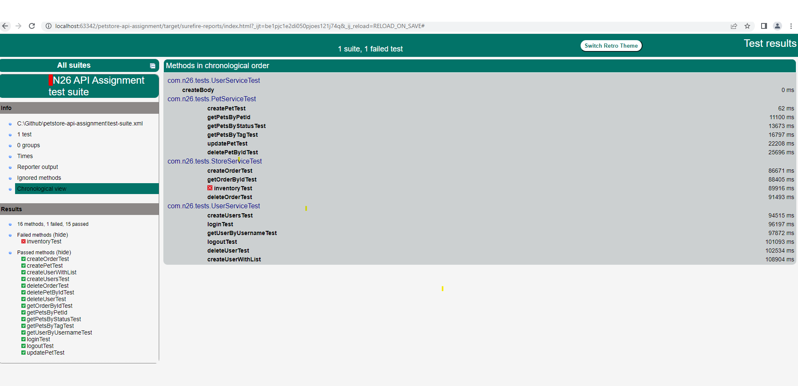
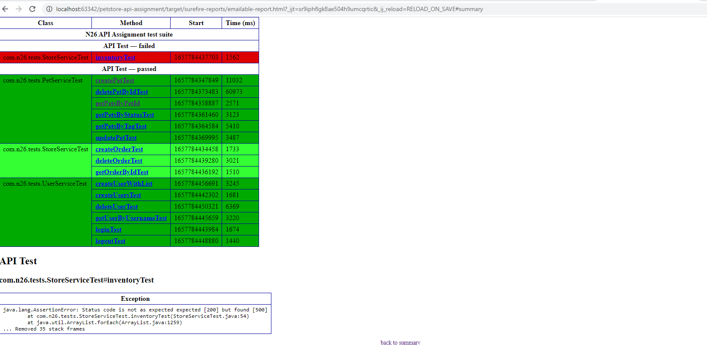

# Task 3 - RESTful API Automation:
The project contains implementation of REST API tests. I used open url endpoints available at https://petstore.swagger.io/ 
In the project I used Java libraries: Slf4j, TestNG, Lombok, RestAssured,Faker and Jackson.

## Required installations
1. Java 8 + Maven
2. IDE : IntelliJ IDEA Community Edition (or you can use IDE of your choice like Eclipse)

## Testing frameworks adaptors:
1. Language : [Java](https://dev.java/)
2. Build Tool and Dependencies Management : [Maven](https://maven.apache.org/what-is-maven.html)
3. API Library : [RestAssured](https://github.com/rest-assured/rest-assured/wiki/GettingStarted)

## Getting Started & necessary installation
1. Ensure installation of above is completed
2. Clone this repository or download the zip with the source code in to your local system.
```
git clone https://github.com/DesaiHimani/petstore-qa-assignment
```

## Test Execution

Run tests from command line
```
mvn clean test
```

## Test Scenarios 
### Pet Endpoint
- POST: Creating a new pet and uploading image
- GET: Finding pet by given id
- GET: Finding pet by given status
- GET: Finding pet by given tag
- PUT: Updating pet using form data
- DELETE: Delete pet by given id

### Store Endpoint
- POST: Place a new order
- GET: Fetch the given order by ID
- DELETE: Delete a newly created order
- GET: Fetch the inventory status

### User Endpoint
- GET: Fetch user details by username
- POST: Create a new user
- POST : Create Users with List
- GET: Log the user into the system
- GET: Log out the current active session
- PUT: Update user


## Test Results
Post Execution a new folder will be created with name 'target'. 
You can see html report here :
```
target/surefire-reports/index.html
```


Also, there is more detailed emailable report generate by surefire plugin. It can be found here :
```
target/surefire-reports/emailable-report.html
```
